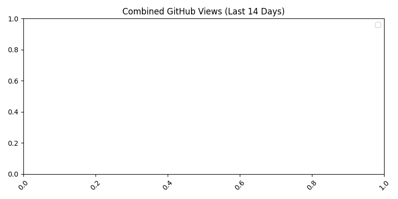
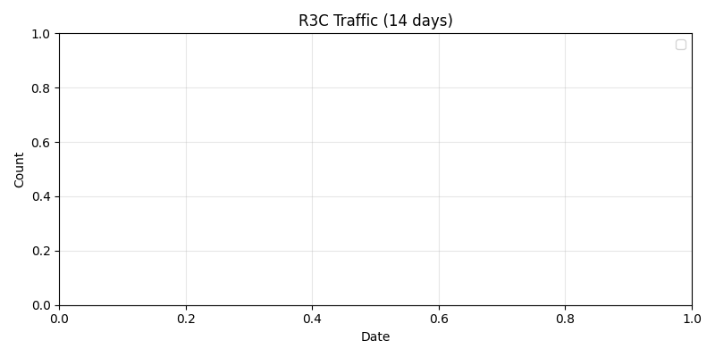

why  I  build  these:  I  want use more  stable, reliable rust.  And  i  want  to  use rust  more  consistently.

📢 **Notice — Ownership Transfer Invitation**

This project is now open for **complete ownership transfer or long-term stewardship**  
to any **organization, foundation, or company** interested in maintaining and evolving it.

The goal is not abandonment, but **continuity** — ensuring that R3C’s vision of  
*LLVM-free, self-sustaining compiler design* continues under professional guidance.

> 💼 Interested parties may contact via [GitHub Issues](https://github.com/0200134/r3c/issues)
> or propose collaboration under a new foundation name.

---

# 🪶 R3C: Rust Independence Philosophy
> “Modern compilers must learn to breathe without LLVM.”

---

<p align="center">
  
</p>

<h1 align="center">🦋 R3C — Rust Independence Compiler</h1>
<p align="center">
  <strong>Rewrite the base. Build compilers that heal themselves.</strong><br>
  <em>Cross-platform C++ · NASM · Rust transpiler pipeline</em>
</p>

<p align="center">
  <a href="https://github.com/0200134/r3c/stargazers"></a>
  <a href="https://github.com/0200134/r3c/releases"></a>
  
  
  <a href="LICENSE"></a>
</p>

---

## 🧭 Overview

**R3C** is an experimental **Rust independence compiler** —  
a cross-platform transpiler that bridges **C++ → Rust → NASM**,  
proving that modern toolchains can evolve *without LLVM or Cargo*.

> 🧠 It’s not about rejecting LLVM —  
> it’s about proving that compilers can **breathe on their own.**

Key principles:
- 🧩 **Zero external dependency:** Self-contained transpilation.
- ⚙️ **Cross-language pipeline:** C++ front, Rust middle, NASM back.
- 🦋 **Self-healing:** Auto-stub generation and build repair logic.
- 🔁 **Self-hosting goal:** Future versions to compile themselves.

---

## ⚙️ Architecture

| Stage | Language | Role | Description |
|--------|-----------|------|-------------|
| 🧱 Core Parser | C++ | Frontend | Lexical/AST parsing for Rust |
| 🦀 Transpiler | Rust | Mid-layer | Translates C++ IR to Rust syntax trees |
| ⚙️ Assembler | NASM | Backend | Produces cross-platform x86/x64 assembly |
| 🧩 Bootstrap Tooling | Bash/Powershell | Automation | Self-repair + multi-OS build system |

---

## 💬 Join the Movement

> 🧠 **R3C** is a *Rust-independence experiment* — proving that a compiler can **self-build, self-repair, and self-deploy** across any platform, without relying on LLVM or Cargo.

We’re looking for contributors who love:
- 🧩 C++ systems engineering  
- ⚙️ Compiler pipelines & NASM  
- 🦀 Rust transpilation  
- 🤖 Self-healing automation  

---

🔧 **Maintainer applications and ownership transfer discussions are open.**  
🌍 Organizations aligned with *open compiler autonomy* are welcome to discuss stewardship, licensing models, or foundation-level transitions.

<p align="center">
  <a href="https://github.com/0200134/r3c/issues/new?template=feature.yml"><b>🚀 Contribute Now</b></a> |
  <a href="https://github.com/0200134/r3c/discussions"><b>💬 Join Discussion</b></a>
</p>

---

## 🪶 Vision

R3C redefines compiler autonomy — not to reject LLVM,  
but to prove that modern compilers can evolve **beyond** it.

> ⚙️ From legacy to safety, from safety to metal.  
> 🧠 From dependency to sovereignty.

---

## 📜 License

MIT License © 2025 [0200134](https://github.com/0200134)

## 🤝 Collaboration Notice

> **Note:**  
> The author is currently fulfilling mandatory military service (public service, 4th grade).  
> Therefore, any **commercial collaboration, consulting, or paid contribution** cannot be accepted at this time.  
>  
> For research, technical discussion, or non-commercial collaboration, feel free to open an issue.  
>  
> 📅 **Available for formal collaboration starting in 2027  later or  after  2028  .**
---

> 🧠 **R3C** — A Rust-independent C++ compiler experiment proving that modern toolchains can self-host without LLVM.


<!--TRAFFIC_START-->
## 📊 Combined GitHub Traffic (last 14 days)



| Metric | Total | Unique |
|--------|--------|--------|
| **Views** | 0 | 0 |
| **Clones** | 0 | 0 |

**Repositories Monitored:**  
- r3c  
- cpppm  
- Rust-ltss
### 🔖 Latest Auto Release: [auto-stable-18746002809](https://github.com/0200134/r3c/releases/tag/auto-stable-18746002809)

```
8739c76e681f900923b900c9df0ef75cf421d39cabb54650c4b9ad19b6a76d85  r3c-linux-latest.zip
```

```
SHA256 hash of r3c-windows-latest.zip:
e7351fcf12d043b074c0725a9fbfebf880eeb989008d71ac9fb819ea4259fe23
CertUtil: -hashfile command completed successfully.

```

```
8739c76e681f900923b900c9df0ef75cf421d39cabb54650c4b9ad19b6a76d85  r3c-macos-latest.zip
```



> 🔄 Weekly digest: [docs/community_feedback.md](docs/community_feedback.md)
