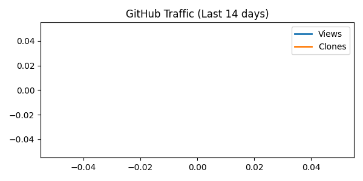

<!--AUTO-BANNER-START-->
🌸 R3C — Rust Independence Compiler
Rewrite the base. Build compilers that heal themselves.
Cross-platform C++ · NASM · Rust transpiler pipeline

⭐ Stars: 1   👁️ Views(14d): 0   🧭 Clones(14d): 0
🧑‍💻 Unique Visitors: 0   🔁 Unique Cloners: 0
⚖️ License: MIT   🕒 Updated: 2025-10-25 00:01 UTC


traffic_graph.png)
traffic_graph.png)
traffic_graph.png)
traffic_graph.png)
<!--AUTO-BANNER-END-->

🌋 Currently featured in global Rust communities

### ⚙️ R3C — The Rust Compiler that breathes without LLVM
If you believe in compiler independence and long-term stability,  
🌟 star this project and help shape the future of Rust sovereignty.

📦 Repository has been officially moved to r3c-foundation/r3c.

why  I  build  these:  I  want use more  stable, reliable rust.  And  i  want  to  use rust  more  consistently.

📢 **Notice — Ownershi6p Transfer Invitation**

This project is now open for **complete ownership transfer or long-term stewardship**  
to any **organization, foundation, or company** interested in maintaining and evolving it.

The goal is not abandonment, but **continuity** — ensuring that R3C’s vision of  
*LLVM-free, self-sustaining compiler design* continues under professional guidance.

> 💼 Interested parties may contact via [GitHub Issues](https://github.com/0200134/r3c/issues)
> or propose collaboration under a new foundation name.

---

# 🪶 R3C: Rust Independence Philosophy
> “Modern compilers must learn to breathe without LLVM.”

---

<p align="center">
  
</p>

<h1 align="center">🦋 R3C — Rust Independence Compiler</h1>
<p align="center">
  <strong>Rewrite the base. Build compilers that heal themselves.</strong><br>
  <em>Cross-platform C++ · NASM · Rust transpiler pipeline</em>
</p>

🌸 **R3C — Rust Independence Compiler**  
Rewrite the base. Build compilers that heal themselves.  
Cross-platform C++ · NASM · Rust transpiler pipeline  

## 🧭 Overview

**R3C** is an experimental **Rust independence compiler** —  
a cross-platform transpiler that bridges **C++ → Rust → NASM**,  
proving that modern toolchains can evolve *without LLVM or Cargo*.

> 🧠 It’s not about rejecting LLVM —  
> it’s about proving that compilers can **breathe on their own.**

Key principles:
- 🧩 **Zero external dependency:** Self-contained transpilation.
- ⚙️ **Cross-language pipeline:** C++ front, Rust middle, NASM back.
- 🦋 **Self-healing:** Auto-stub generation and build repair logic.
- 🔁 **Self-hosting goal:** Future versions to compile themselves.

---

## ⚙️ Architecture

| Stage | Language | Role | Description |
|--------|-----------|------|-------------|
| 🧱 Core Parser | C++ | Frontend | Lexical/AST parsing for Rust |
| 🦀 Transpiler | Rust | Mid-layer | Translates C++ IR to Rust syntax trees |
| ⚙️ Assembler | NASM | Backend | Produces cross-platform x86/x64 assembly |
| 🧩 Bootstrap Tooling | Bash/Powershell | Automation | Self-repair + multi-OS build system |

---

## 💬 Join the Movement

> 🧠 **R3C** is a *Rust-independence experiment* — proving that a compiler can **self-build, self-repair, and self-deploy** across any platform, without relying on LLVM or Cargo.

We’re looking for contributors who love:
- 🧩 C++ systems engineering  
- ⚙️ Compiler pipelines & NASM  
- 🦀 Rust transpilation  
- 🤖 Self-healing automation  

---

🔧 **Maintainer applications and ownership transfer discussions are open.**  
🌍 Organizations aligned with *open compiler autonomy* are welcome to discuss stewardship, licensing models, or foundation-level transitions.

<p align="center">
  <a href="https://github.com/0200134/r3c/issues/new?template=feature.yml"><b>🚀 Contribute Now</b></a> |
  <a href="https://github.com/0200134/r3c/discussions"><b>💬 Join Discussion</b></a>
</p>

---

## 🪶 Vision

R3C redefines compiler autonomy — not to reject LLVM,  
but to prove that modern compilers can evolve **beyond** it.

> ⚙️ From legacy to safety, from safety to metal.  
> 🧠 From dependency to sovereignty.

---
---

### ⚖️ Governance & Neutral Position

R3C stands as an **independent Rust compiler experiment**, exploring how Rust can sustain itself beyond LLVM without losing compatibility or transparency.  
It is **not an anti-LLVM project**, but a *resilience study* — a Plan-B architecture for compiler continuity.

- 🧩 **Respect for LLVM and Rust Foundation** —  
  R3C does not use or redistribute LLVM/Apple/Rust trademarks, binaries, or code.  
  All work follows the MIT license and public documentation standards.

- 🧠 **Open Dialogue Policy** —  
  If any organization (LLVM, Rust Foundation, or others) has questions or requests  
  about terminology or references, please open an Issue or contact via  
  `0200134hjh@gmail.com` for immediate review.

- 🏛️ **Transparent Research** —  
  All commits, CI logs, and release pipelines are fully public.  
  Discussions are recorded through Issues and PRs for traceability.

> “We are not escaping LLVM — we are transcending it.”  
> The goal is *coexistence through autonomy*, not separation through conflict.
>

## 📜 License

MIT License © 2025 [0200134](https://github.com/0200134)

## 🤝 Collaboration Notice

> **Note:**  
> The author is currently fulfilling mandatory military service (public service, 4th grade).  
> Therefore, any **commercial collaboration, consulting, or paid contribution** cannot be accepted at this time.  
>  
> For research, technical discussion, or non-commercial collaboration, feel free to open an issue.  
>  
> 📅 **Available for formal collaboration starting in 2027  later or  after  2028  .**
---

> 🧠 **R3C** — A Rust-independent C++ compiler experiment proving that modern toolchains can self-host without LLVM.


## 🌿 Collaborative Branch Access

R3C allows **automatic and contributor-friendly branch creation**.

Anyone with contributor permission can open a new branch directly —  
no manual approval is needed.

To create a new branch automatically:
- Comment `/branch your-feature-name` on any issue or PR.
- The R3C automation bot will create and push the branch for you.

This system enables Rust and C++ contributors to:
- Prototype new modules
- Extend the compiler pipeline
- Experiment with IR, parser, or backend logic independently

> 💡 Example  
> `/branch rust-ffi` → creates branch `rust-ffi` automatically via GitHub Actions.

All generated branches are linked to the auto-stable CI/CD system,  
so once merged, they’re automatically included in the next **Auto Stable Release**.


### 🔖 Latest Auto Release: [auto-stable-18764886872](https://github.com/0200134/r3c/releases/tag/auto-stable-18764886872)

```
55aa884110e73fad94ae2a5d50943d7807441f9a81726310c282c1a639e5d298  r3c-linux-latest.zip
```

```
SHA256 hash of r3c-windows-latest.zip:
0e559938a0fd25be65fa058d53066eb209a73c730a0019ca5a6ea089d5908080
CertUtil: -hashfile command completed successfully.

```

```
35de73fbe3919f29889f6405ec5a3bfdf422ea323f091eb73575166c870c1719  r3c-macos-latest.zip
```

---
⭐ Starred by builders who believe Rust deserves independence.

🚀 Featured on Reddit r/rust — Ignition Phase of R3C has begun.  
🔥 Over 700+ views in under 30 minutes.  
🧠 The LLVM-free Rust compiler evolution continues.


\n\n### 🔐 Latest Checksums\n```\ne47bc6cc3215b809be1ffd760a0f7c4ed2a204941ae99c75f258809b9fb9140f  ./r3c-windows-latest/r3c-windows.zip
18515b74eeb25a1d4c0898c9384d52d7c57f7c8f7a139cd4a02618f94ebceccc  ./r3c-macos-latest/r3c-macos.tar.gz
13eb0b2d24e266b52e11b37b6f65eb66a7b8656ac7d16059d26b69bd2ead5185  ./r3c-ubuntu-latest/r3c-linux.tar.gz\n```\n
\n\n### 🔐 Latest Checksums\n```\nabfeea3ee41a2d29b74cda4f07cb4905e545bd0dc78da1137d46877902e52c06  ./r3c-windows-latest/r3c-windows.zip
81015ce0529b182742f0631a7e4f9f38e808d880aeea50a09c2de8501383be4f  ./r3c-macos-latest/r3c-macos.tar.gz
c118a3e8f58cd487873af51fe8a9d65241a1917302b99a8ea8d53c7ae287cf2b  ./r3c-ubuntu-latest/r3c-linux.tar.gz\n```\n
\n\n### 🔐 Latest Checksums\n```\ned996d7c563e73511a689c2a21ec368ed2331ad2fb0c474d765c49ee2a45f0f7  ./r3c-windows-latest/r3c-windows.zip
376e5565c740dfe628eec146aba925b3ffbba6d626d8bc7d0e2a8c1f61f33891  ./r3c-macos-latest/r3c-macos.tar.gz
ae6f5c30d591b6e2f5d7a0b10d1500fb1a37017c00d5e2fceaa6872a4c7a2ecf  ./r3c-ubuntu-latest/r3c-linux.tar.gz\n```\n
\n\n### 🔐 Latest Checksums\n```\nabc546dc95eabc6f72e02509dc3b5aea572f038d5b26ac6966b2b4e02686d9f2  ./r3c-windows-latest/r3c-windows.zip
dc420b3249f86f18e1ef66d73cf466e4fd5afd93364eb60f8737958973bb3bd3  ./r3c-macos-latest/r3c-macos.tar.gz
5bddc4ea83d77cdc7cd49d808ee19b6e3094198cc59d58ab08ecd98fec13fc67  ./r3c-ubuntu-latest/r3c-linux.tar.gz\n```\n
\n\n### 🔐 Latest Checksums\n```\n3b6ec84746a96cd122ca4960cf7eec0d58d652d8dbf6950c0a87a8a6ddfe1bf6  ./r3c-windows-latest/r3c-windows.zip
01a1e32fdfd35e77c71420ac76737353e733b64e76c97ee34b3121d2f4d2bf27  ./r3c-macos-latest/r3c-macos.tar.gz
769c517f8ed371fff23a263082dc27c73c0f6e3b367386f843870a74d1a0c625  ./r3c-ubuntu-latest/r3c-linux.tar.gz\n```\n
